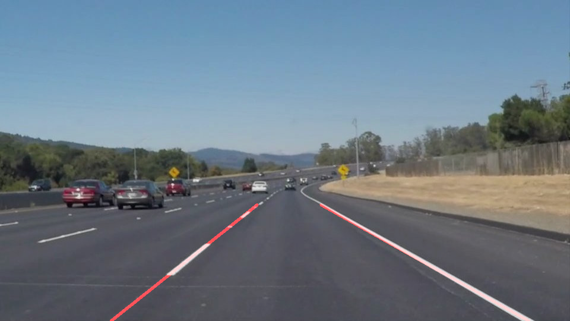
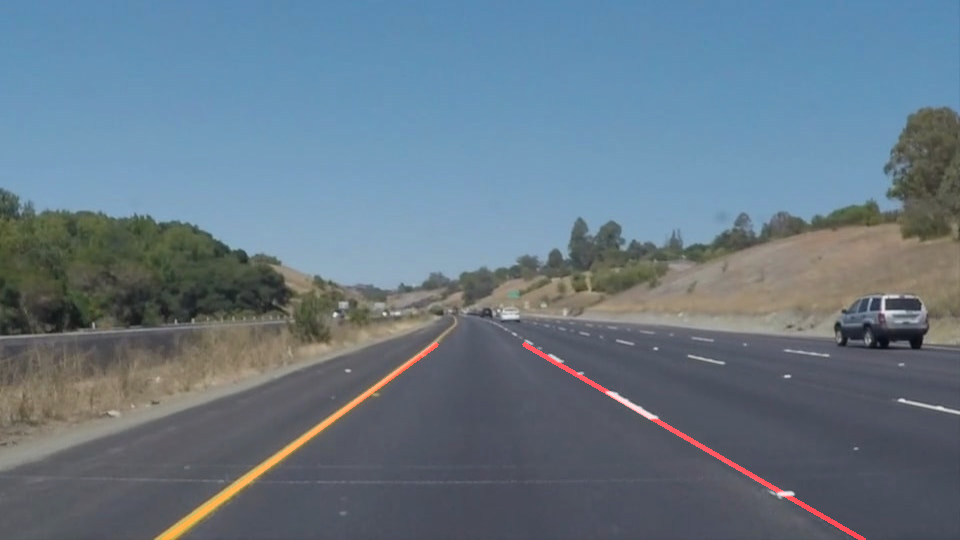

**Overview**
---

This repository is built for the lane detection project from the Udacity's Selft Driving Car Nano Degree.

**Discussion about the Project**
--

The goal of the project is to detect lanes on the road from camera images that are captured while driving on a car. The pipeline consists of 6 steps:

* Color segmentation for yellow and white lanes
* Gaussian blur for smoothing the noises in the images
* Polygon region masking to remove unwanted features in the image except for the lanes
* Canny edge detectors to detect and highlight edges of the lanes
* Hough transformation to parameterize edges 
* Sort through parameterized edges to hand pick the edges that belong to the lanes and draw them

The most challenging part of the project was building a robust detector for lanes on the road even though there may be variations in their appearances due to changing lighting conditions. To overcome this challenge I used HSV color transformation to detect the yellow lanes. This helped to make sure the yellow lanes can be detected even under shadows of trees on the road.

Picking the correct parameters to sort through lines that are computed from hough transformation can also get tricky because the car lanes are not perfectly straight and can vary depending on where the car is relative to them. The hough transofmration paramters needed to be tuned properly to detect the lanes. I used thresholding and averaging to construct the prediction of where the lanes exist.

**Sample Input**
--

**Sample Output**
--

**Possible Improvements**
--
1. The car lanes are not technically always straight. Bezier curve may be used to more accurately model the shape of the detected lanes based on the output of Hough transform.

2. The lane predction can get quite erratic over time because of the movement of the car. The movement of the car equates to variation in lighting and projected angle of the line in the camera view. This can introduces artefacts that lead to uncertanties in the prediction. This can be mitigated by leveraging the fact that in between two consecutive frames, there should not be much change in the trend of the lanes. Moving average smoothing may be applied to then reduce the sensitivity of the model to reduce the motion artefacts.

